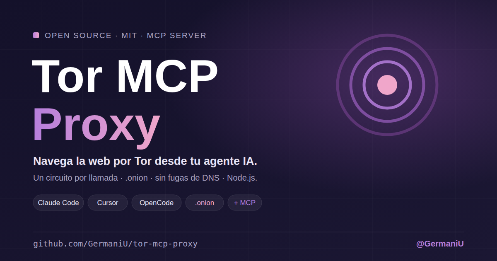

<p align="center">
  
</p>

[English](README.en.md) · **Español**

# Tor MCP Proxy — Navegación web por Tor para agentes IA vía MCP

> **Dale a tu agente IA acceso a la web sin revelar tu IP.**
> Servidor MCP open source que permite a Claude Code, Claude Desktop, Cursor, OpenCode y cualquier cliente compatible con [Model Context Protocol](https://modelcontextprotocol.io) navegar **a través de Tor**, incluidos los servicios `.onion`. Usa un circuito nuevo en cada llamada, no tiene fugas de DNS y reintenta solo cuando un nodo de salida está bloqueado.

[](LICENSE)
[](https://modelcontextprotocol.io)
[](package.json)
[](https://github.com/GermaniU/tor-mcp-proxy/actions/workflows/ci.yml)
[](https://www.torproject.org)
[](CONTRIBUTING.md)

**Tags:** `mcp-server` · `tor` · `onion` · `privacy` · `socks5` · `ai-agents` · `claude-code` · `cursor` · `opencode` · `web-scraping` · `self-hosted`

---

## 💡 Por qué existe

Los agentes IA navegan con **tu IP**. Así, cada sitio que consultan sabe quién eres, y muchos bloquean o limitan las peticiones automatizadas. **Tor MCP Proxy** resuelve esto con tres ideas simples:

1. **Tu IP nunca sale.** Todo el tráfico pasa por Tor, incluida la resolución DNS. No hay ninguna ruta directa de respaldo.
2. **Un circuito nuevo en cada llamada.** Cada tool usa una identidad SOCKS distinta, y Tor le asigna su propio nodo de salida, así que las llamadas no se pueden vincular entre sí. Si un nodo está bloqueado, se reintenta con otro.
3. **Acceso a `.onion` sin configuración extra.** Funciona con servicios ocultos v3, también los que usan certificados autofirmados.

---

## ⚡ Quickstart (3 comandos)

```bash
brew install tor && brew services start tor     # o: sudo apt install tor
git clone https://github.com/GermaniU/tor-mcp-proxy.git && cd tor-mcp-proxy && npm ci
claude mcp add tor-proxy --scope user -- node "$PWD/index.js"
```

Requiere **Node.js 22.19+** y Tor escuchando en `127.0.0.1:9050`. Para otros clientes, consulta [`docs/CLIENTS.md`](docs/CLIENTS.md). Para otros sistemas operativos, consulta [`docs/INSTALL.md`](docs/INSTALL.md).

### 🔍 Diagnóstico

Este comando verifica Node.js, que Tor escuche, que el tráfico **realmente** salga por Tor y que cada llamada use un circuito distinto:

```bash
npm run doctor
```

---

## 🛠 Tools MCP expuestas

| Tool | Red | Para qué |
|---|---|---|
| `fetch_page` | Tor | Descarga una página (HTTP(S) o `.onion`) y devuelve su texto o el HTML crudo. Acepta GET, POST, PUT y PATCH, y sesiones con `session_id` (mismo circuito y cookies). |
| `check_exit_ip` | Tor | Muestra la IP que ven los sitios, es decir, la del nodo de salida. |
| `search_onion` | Tor | Busca en DuckDuckGo a través de su servicio `.onion`, sin salir de Tor. |
| `download_file` | Tor | Guarda un documento, imagen o archivo comprimido en el directorio de descargas. Nunca sobrescribe archivos. |
| `extract_links` | — | Lista los enlaces de un HTML; por defecto, solo los `.onion`. |
| `page_metadata` | — | Resume un HTML: título, encabezados, enlaces, formularios y metadatos. |

Los parámetros y ejemplos de uso de cada tool están en [`docs/CLIENTS.md`](docs/CLIENTS.md#referencia-de-tools).

---

## 🎯 Alcance actual

Tor MCP Proxy es deliberadamente pequeño. Hace **una cosa bien: traer contenido web por Tor para un agente**. No es un navegador ni un crawler.

### Lo que SÍ hace
- ✅ Envía cada petición por Tor, con la resolución DNS incluida.
- ✅ Usa un circuito independiente por llamada y reintenta con otro nodo de salida si recibe 403, 429 o 5xx.
- ✅ Accede a servicios `.onion` v3, también con HTTPS autofirmado.
- ✅ Mantiene sesiones con cookies separadas por dominio para logins y formularios.
- ✅ Descarga archivos dentro de un directorio aislado (sandbox).
- ✅ Incluye protección SSRF y límites de tamaño en todas las respuestas.

### Lo que NO hace (todavía)
- ❌ **No ejecuta JavaScript.** Las páginas que se construyen en el navegador devuelven poco texto.
- ❌ **No es Tor Browser.** El User-Agent es el de Tor Browser, pero la huella TLS es la de Node.js. Lee [`SECURITY.md`](SECURITY.md).
- ❌ **No elige país de salida.** Tor asigna los nodos de salida al azar.
- ❌ **No es rápido.** Cuenta con 2–10 s por petición.
- ❌ **No resuelve CAPTCHAs** ni evade bloqueos deliberados.

Si necesitas algo de la lista del NO, abre un [issue](https://github.com/GermaniU/tor-mcp-proxy/issues) con un caso de uso real.

---

## 🔌 Conectar tu cliente

Tienes la configuración lista para copiar en [`docs/CLIENTS.md`](docs/CLIENTS.md):

- 🟦 **Claude Code**: `claude mcp add tor-proxy --scope user -- node /ruta/a/tor-mcp-proxy/index.js`
- 🟫 **Claude Desktop**: `claude_desktop_config.json`
- 🟧 **Cursor**: Settings → MCP Servers
- 🟪 **OpenCode**: `opencode.json`

Hay snippets listos en [`examples/`](examples/).

---

## ⚙️ Configuración

Todo es opcional y se configura con variables de entorno. Estas son las más usadas:

| Variable | Default | Para qué |
|---|---|---|
| `TOR_SOCKS5` | `socks5://127.0.0.1:9050` | Dirección del proxy de Tor. |
| `TOR_DOWNLOAD_DIR` | `~/Downloads/tor-mcp-proxy` | El único directorio donde escribe `download_file`. |
| `TOR_MAX_RETRIES` | `3` | Cuántas veces reintentar con un circuito nuevo. |
| `TOR_LOG_PATH` | *(desactivado)* | Log de auditoría en formato JSONL. ⚠️ Registra URLs y búsquedas. |

La lista completa está en [`docs/INSTALL.md`](docs/INSTALL.md#variables-de-entorno).

---

## 🧪 Smoke test contra Tor real

```bash
npm run smoke
```

Este comando arranca el servidor por stdio, como lo haría un cliente MCP, y prueba las tools contra la red real:
- `check_exit_ip`;
- `fetch_page` sobre check.torproject.org y sobre el `.onion` de DuckDuckGo;
- `search_onion`.

---

## 🧱 Arquitectura (vertical slice)

```
┌─ tu agente (Claude Code / Cursor / OpenCode / …) ─┐
│           │ MCP stdio                             │
└───────────┼───────────────────────────────────────┘
            ▼
   ┌──────────────────┐   lib/features/<tool>/   ← una carpeta por tool
   │  tor-mcp-proxy   │   lib/shared/            ← red, HTML, MCP (sin estado global)
   │    (Node.js)     │   lib/app/               ← config + inyección de dependencias
   └────────┬─────────┘
            │ SOCKS5 (un circuito por llamada)
            ▼
   ┌──────────────────┐        ┌───────────────┐
   │   Tor (local)    │ ─────▶ │ nodo de salida │ ─────▶ sitio web / .onion
   └──────────────────┘        └───────────────┘
```

Cada tool vive en su propia carpeta (`lib/features/<tool>/`). Para añadir una tool basta crear una carpeta y añadir una línea en `lib/features/index.js`. Un test de arquitectura impide que las capas se mezclen.

El detalle técnico está en [`docs/ARCHITECTURE.md`](docs/ARCHITECTURE.md).

---

## 🔒 Seguridad y privacidad

- **Sin fugas de DNS.** Los hostnames los resuelve Tor, nunca tu resolver local.
- **Cookies separadas por dominio** en las sesiones, con `tough-cookie` y la Public Suffix List.
- **Las redirecciones no pueden sacarte de `.onion` hacia clearnet.**
- **Descargas aisladas** en `TOR_DOWNLOAD_DIR`: no sobrescriben archivos y rechazan rutas `..`, archivos ocultos y symlinks.
- **Protección SSRF**: rechaza IPs privadas, loopback y de metadata de nubes.

El modelo de amenazas completo, con lo que este proxy **no** protege, está en [`SECURITY.md`](SECURITY.md). Si encuentras una vulnerabilidad, repórtala de forma privada desde la pestaña Security del repo.

---

## 🤝 Contribuye

Tor MCP Proxy es MIT y sin trampas. PRs, issues y forks son bienvenidos.

**Reglas (resumen):**
1. **Primero la privacidad.** No se acepta ningún cambio que envíe tráfico o DNS fuera de Tor.
2. **Clean Code · SOLID · KISS · YAGNI · Vertical slice · Tests primero.** No se aceptan PRs sin tests.
3. **Identificadores en inglés, commits en español.** Usa Conventional Commits (`feat:`, `fix:`, `docs:`, …).
4. **Una tool nueva = una carpeta nueva.** No toques slices existentes salvo para corregir un bug.
5. **DIP:** las features usan `context.web` y nunca importan `undici`. Lo verifica `test/architecture.test.js`.

El detalle completo está en [`CONTRIBUTING.md`](CONTRIBUTING.md).

```bash
# Setup local de desarrollo (no necesita Tor)
npm ci
npm run lint       # ESLint
npm run check      # sintaxis de todos los archivos
npm test           # unit + integración + protocolo MCP, ~2 s, sin red
```

---

## 🩹 Troubleshooting

**`Could not connect to the Tor SOCKS5 proxy`**
- Tor no está corriendo o escucha en otro puerto. Ejecuta `npm run doctor`. Tor Browser usa el puerto `9150`; para usarlo, define `TOR_SOCKS5=socks5://127.0.0.1:9150`.

**`HTTP 403 … (still failing after 4 attempts on independent Tor circuits)`**
- El sitio bloquea a todos los nodos de salida de Tor. No es un bug: muchos sitios lo hacen. Busca el mismo contenido en otra fuente o en su versión `.onion`.

**`Request timed out`**
- La red Tor está lenta o el circuito es malo. Reintenta, o sube `TOR_REQUEST_TIMEOUT_MS` (máximo 120000).

**La página devuelve muy poco texto**
- Seguramente se construye con JavaScript en el navegador. Prueba con `raw: true` para ver el HTML real, o busca una versión sin JS del sitio.

**`download_file` dice `A file already exists`**
- Es intencional: nunca se sobrescribe un archivo. Usa otro `output_path`.

---

## 📚 Documentación

- [`docs/INSTALL.md`](docs/INSTALL.md): instalación detallada, todas las variables y troubleshooting extendido.
- [`docs/CLIENTS.md`](docs/CLIENTS.md): configuración por cliente y referencia de las tools.
- [`docs/ARCHITECTURE.md`](docs/ARCHITECTURE.md): decisiones técnicas y sus motivos.
- [`SECURITY.md`](SECURITY.md): modelo de amenazas y cómo reportar vulnerabilidades.
- [`CONTRIBUTING.md`](CONTRIBUTING.md): disciplinas, flujo de trabajo y cómo añadir una tool.
- [`CHANGELOG.md`](CHANGELOG.md): historial de cambios.

---

## 📄 Licencia

[MIT](LICENSE). Basado en [DataImpulse-MCP](https://github.com/Gentleman-Programming/dataimpulse-mcp) (MIT) de Gentleman Programming.

---

**Hecho por [@GermaniU](https://github.com/GermaniU)**. Si te ha servido, una ⭐ ayuda a que más gente lo encuentre. Si algo se rompe, abre un issue y lo arreglamos.
